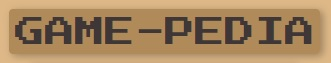
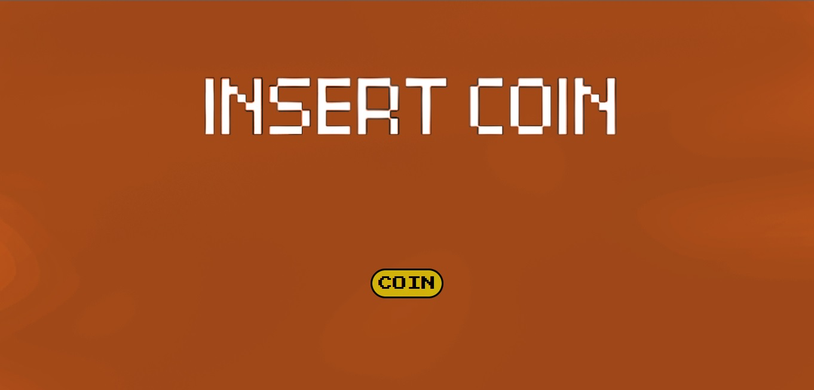

    

<h1 align='center'>GAME-PEDIA App - Ezequiel Camargo</h1>

  

## About

This is a basic videogame encyclopedia app (that's why the name) implemented in JavaScript.

It is made based on:

- Back-End server with a relational database made with PostgreSQL-Sequelize, integrated in NodeJs using Express library.

- Front-End interface made with React Js and Redux; styles made with pure CSS with any external libraries.

## How it works?

Back-End consumes the rawg.io API and fetches games data. This data is processed at backend and concatenated with data stored at Postgres db.

Finally, handles http requests in order to provide Front-End with useful information to display.

Front-End has 4 different routes: Home, Catalog, Post and Details:

- Home is the landing page.

- Catalog shows up to 12 games per page, with ordering buttons, filters and a search bar if you are looking for any specific game. Clicking each game with redirect to the Game Detail route.

- Post is a route where users can add their own game to the catalog, which is stored inside the database.

You can take a look at some images of this app below 🔻

  

  

  

  

You can take a look at this page here --> https://game-pedia-app.vercel.app/
